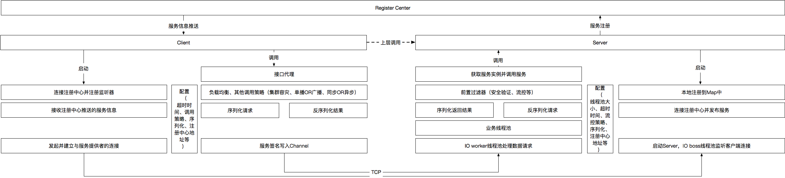

[](/LICENSE)
[](http://search.maven.org/#search%7Cga%7C1%7Cg%3A%22org.jupiter-rpc%22%20AND%20jupiter)
[](https://travis-ci.org/fengjiachun/Jupiter)
[](https://lgtm.com/projects/g/fengjiachun/Jupiter/context:java)
[](https://lgtm.com/projects/g/fengjiachun/Jupiter/alerts)

#### Jupiter:
- Jupiter是一款性能非常不错的, 轻量级的分布式服务框架

#### Jupiter Architecture:

           ═ ═ ═▷ init         ─ ─ ─ ▷ async       ──────▶ sync
    ----------------------------------------------------------------------------------------

                                ┌ ─ ─ ─ ─ ─ ─ ─ ─ ─ ─
                                           ┌ ─ ─ ─ ┐ │
               ─ ─ ─ ─ ─ ─ ─ ─ ─│ Registry  Monitor ───────────────────────────┐
              │                            └ ─ ─ ─ ┘ │                         │
                                └ ─ ─△─ ─ ─ ─ ─△─ ─ ─                          ▼
              │                                                           ┌ ─ ─ ─ ─
            Notify                   ║         ║                            Telnet │
              │         ═ ═ ═ ═ ═ ═ ═           ═ ═ ═ ═ ═ ═ ═ ═ ═         └ ─ ─ ─ ─
                       ║                                         ║             ▲
              │    Subscribe                                  Register         │
                       ║                                         ║             │
              │  ┌ ─ ─ ─ ─ ─                          ┌ ─ ─ ─ ─ ─ ─ ─ ─ ─ ─    │
                            │─ ─ ─ ─ ─ ─ ─ ─ ─ ─ ─ ─ ▷           ┌ ─ ─ ─ ┐ │   │
              └ ▷│ Consumer           Invoke          │ Provider  Monitor ─────┘
                            │────────────────────────▶           └ ─ ─ ─ ┘ │
                 └ ─ ─ ─ ─ ─                          └ ─ ─ ─ ─ ─ ─ ─ ─ ─ ─

    ---------------------------------------------------------------------------------------


#### [RELEASE-NOTES](/docs/release-notes.md)

#### 性能:
- 小数据包请求(不带业务)在四核刀片服务器上可达到17w+的tps, 详情见 [Benchmark](https://github.com/fengjiachun/Jupiter/wiki/Benchmark)
- [参考: 多个RPC框架的Benchmark见这里](https://github.com/hank-whu/rpc-benchmark)

#### 文档:
- [High performance RPC with netty](/docs/static_files/high_performance_rpc_with_netty.md)
- [High performance RPC with netty.pdf](/docs/static_files/high_performance_rpc_with_netty.pdf)
- [Wiki](https://github.com/fengjiachun/Jupiter/wiki)
- [其他文档](https://github.com/fengjiachun/doc/tree/master/jupiter)
- [发展路线](https://github.com/fengjiachun/Jupiter/wiki/RoadMap)

#### 一次RPC调用:



<p align="right">感谢 @远墨 提供的图</p>

#### 快速开始:

##### 工程依赖:
+ JDK1.7或更高版本
+ 依赖管理工具: Maven3.x版本

##### [最新版本OSS下载](https://oss.sonatype.org/#nexus-search;quick~org.jupiter-rpc)
##### [最新版本Maven中心仓库下载](http://search.maven.org/#search%7Cga%7C1%7Cg%3A%22org.jupiter-rpc%22%20AND%20jupiter)
##### Maven依赖:
```xml
<dependency>
    <groupId>org.jupiter-rpc</groupId>
    <artifactId>jupiter-all</artifactId>
    <version>${jupiter.version}</version>
</dependency>
```

##### 简单调用示例:
###### 1. 创建服务接口:

```java
@ServiceProvider(group = "test", name = "serviceTest")
public interface ServiceTest {
    String sayHelloString();
}

@ServiceProvider:
    - 建议每个服务接口通过此注解来指定服务信息, 如不希望业务代码对jupiter依赖也可以不使用此注解而手动去设置服务信息
        + group: 服务组别(选填, 默认组别为'Jupiter')
        + name: 服务名称(选填, 默认名称为接口全限定名称)
```

###### 2. 创建服务实现:

```java
@ServiceProviderImpl(version = "1.0.0")
public class ServiceTestImpl implements ServiceTest {

    @Override
    public String sayHelloString() {
        return "Hello jupiter";
    }
}

@ServiceProviderImpl:
    - 建议每个服务实现通过此注解来指定服务版本信息, 如不希望业务代码对jupiter依赖也可以不使用此注解而手动去设置版本信息
        + version: 服务版本号(选填, 默认版本号为'1.0.0')
```

###### 3. 启动注册中心:

###### - 选择1: 使用jupiter默认的注册中心:

```java
public class HelloJupiterRegistryServer {

    public static void main(String[] args) {
        // 注册中心
        RegistryServer registryServer = RegistryServer.Default.createRegistryServer(20001, 1);
        try {
            registryServer.startRegistryServer();
        } catch (InterruptedException e) {
            e.printStackTrace();
        }
    }
}
```

###### - 选择2: 使用[zookeeper](https://zookeeper.apache.org/doc/trunk/zookeeperStarted.html)作为注册中心:

```xml
默认注册中心只建议在测试环境使用, 线上建议使用zookeeper实现

// 设置使用zookeeper作为注册中心
JServer server = new DefaultServer(RegistryService.RegistryType.ZOOKEEPER)
JClient client = new DefaultClient(RegistryService.RegistryType.ZOOKEEPER)

在server和client中配置jupiter-registry-zookeeper依赖(jupiter-all包含jupiter-registry-zookeeper)

<dependency>
    <groupId>org.jupiter-rpc</groupId>
    <artifactId>jupiter-registry-zookeeper</artifactId>
    <version>${jupiter.version}</version>
</dependency>
```

###### 4. 启动服务提供(Server):

```java
public class HelloJupiterServer {

    public static void main(String[] args) throws Exception {
        JServer server = new DefaultServer().withAcceptor(new JNettyTcpAcceptor(18090));
        // provider
        ServiceTestImpl service = new ServiceTestImpl();
        // 本地注册
        ServiceWrapper provider = server.serviceRegistry()
                .provider(service)
                .register();
        // 连接注册中心
        server.connectToRegistryServer("127.0.0.1:20001");
        // 向注册中心发布服务
        server.publish(provider);
        // 启动server
        server.start();
    }
}
```

###### 5. 启动服务消费者(Client)

```java
public class HelloJupiterClient {

    public static void main(String[] args) {
        JClient client = new DefaultClient().withConnector(new JNettyTcpConnector());
        // 连接RegistryServer
        client.connectToRegistryServer("127.0.0.1:20001");
        // 自动管理可用连接
        JConnector.ConnectionWatcher watcher = client.watchConnections(ServiceTest.class);
        // 等待连接可用
        if (!watcher.waitForAvailable(3000)) {
            throw new ConnectFailedException();
        }

        ServiceTest service = ProxyFactory.factory(ServiceTest.class)
                .version("1.0.0")
                .client(client)
                .newProxyInstance();

        service.sayHelloString();
    }
}
```

[Server/Client代码示例](https://github.com/fengjiachun/Jupiter/tree/master/jupiter-example/src/main/java/org/jupiter/example/round)

##### 结合Spring使用示例:
###### 1. [Server端配置](/jupiter-example/src/main/resources/spring-provider.xml):

```xml
<jupiter:server id="jupiterServer" registryType="default"> <!-- registryType="zookeeper" 代表使用zk作为注册中心 -->
    <jupiter:property registryServerAddresses="127.0.0.1:20001" />
</jupiter:server>

<!-- provider -->
<bean id="serviceTest" class="org.jupiter.example.ServiceTestImpl" />

<jupiter:provider id="serviceTestProvider" server="jupiterServer" providerImpl="serviceTest">
    <jupiter:property weight="100"/>
</jupiter:provider>
```

###### 2. [Client端配置](/jupiter-example/src/main/resources/spring-consumer.xml):

```xml
<jupiter:client id="jupiterClient" registryType="default"> <!-- registryType="zookeeper" 代表使用zk作为注册中心 -->
    <jupiter:property registryServerAddresses="127.0.0.1:20001" />
</jupiter:client>

<!-- consumer -->
<jupiter:consumer id="serviceTest" client="jupiterClient" interfaceClass="org.jupiter.example.ServiceTest">
    <jupiter:property version="1.0.0.daily" />
    <jupiter:property serializerType="proto_stuff" />
    <jupiter:property loadBalancerType="round_robin" />
    <jupiter:property timeoutMillis="3000" />
    <jupiter:property clusterStrategy="fail_over" />
    <jupiter:property failoverRetries="2" />
    <jupiter:methodSpecials>
        <!-- 方法的单独配置 -->
        <jupiter:methodSpecial methodName="sayHello" timeoutMillis="5000" clusterStrategy="fail_fast" />
    </jupiter:methodSpecials>
</jupiter:consumer>
```

[SpringServer/SpringClient代码示例](https://github.com/fengjiachun/Jupiter/tree/master/jupiter-example/src/main/java/org/jupiter/example/spring)

##### [更多示例代码](https://github.com/fengjiachun/Jupiter/tree/master/jupiter-example/src/main/java/org/jupiter/example)


#### 其他
- qq交流群: 397633380
- 邮件交流: jiachun_fjc@163.com
