## 提纲
1. 什么是Netty? 能做什么?
2. 贴近日常生活, 先设计一个服务框架
3. RPC的一些Features&好的实践
4. 如何压榨性能
5. Why Netty? (延伸: Netty --> NIO --> Linux Epoll一些实现细节)

## 什么是Netty? 能做什么?
* Netty是一个致力于创建高性能网络应用程序的成熟的IO框架
* 相比较与直接使用底层的Java IO API, 你不需要先成为网络专家就可以基于Netty去构建复杂的网络应用
* 业界常见的涉及到网络通信的相关中间件大部分基于Netty实现网络层

## 设计一个分布式服务框架
* ### __Architecture__

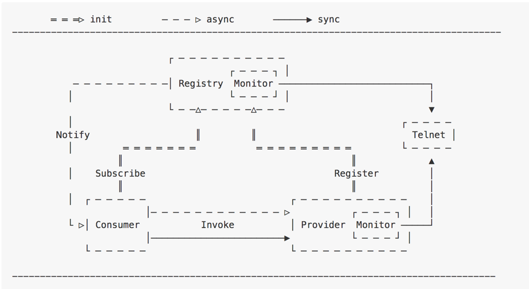

    
* ### __远程调用的流程__
    * 启动服务端(服务提供者)并发布服务到注册中心
    * 启动客户端(服务消费者)并去注册中心订阅感兴趣的服务
    * 客户端收到注册中心推送的服务地址列表
    * 调用者发起调用, Proxy从服务地址列表中选择一个地址并将请求信息<group, providerName, version>, methodName, args[]等信息序列化为字节数组并通过网络发送到该地址上
    * 服务端收到收到并反序列化请求信息, 根据<group, providerName, version>从本地服务字典里查找到对应providerObject, 再根据<methodName, args[]>通过反射调用指定方法, 并将方法返回值序列化为字节数组返回给客户端
    * 客户端收到响应信息再反序列化为Java对象后由Proxy返回给方法调用者
    
        以上流程对方法调用者是透明的, 一切看起来就像本地调用一样,

        重要概念: RPC三元组 <ID, Request, Response>

* ### __远程调用客户端图解__

    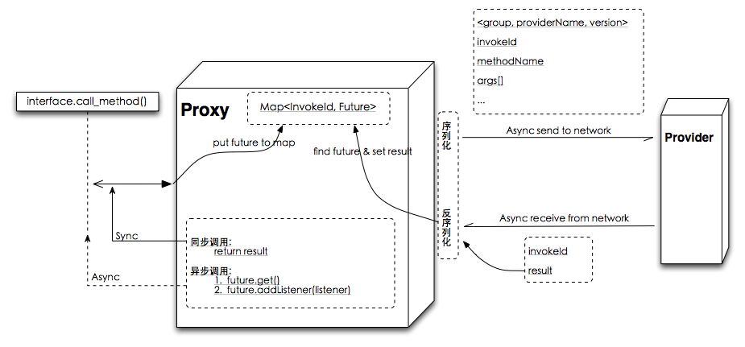

    若是netty4.x的线程模型, IO Thread(worker) —> Map<InvokeId, Future>代替全局Map能更好的避免线程竞争

* ### __远程调用服务端图解__

    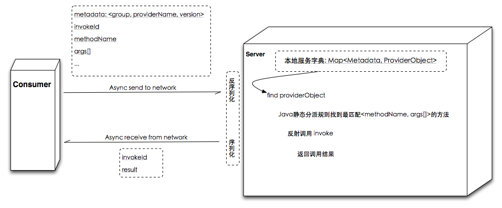

    重要概念: RPC三元组 <ID, Request, Response>

* ### __远程调用传输层图解__

    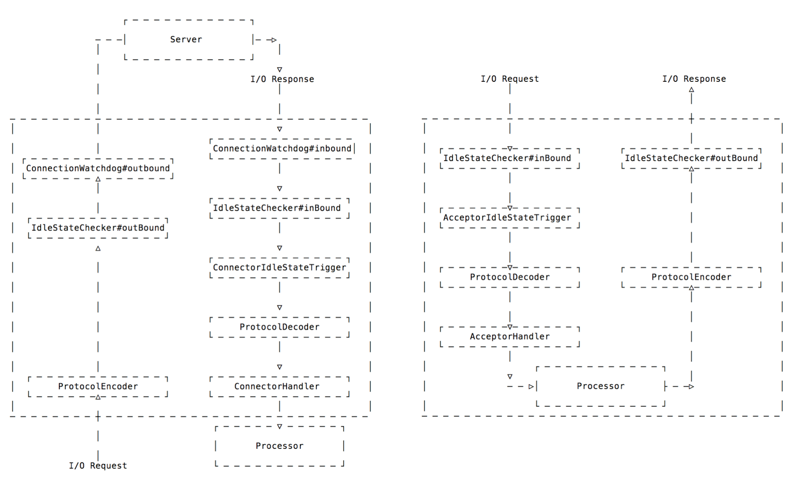

    左图为客户端, 右图为服务端

* ### __设计传输层协议栈__
    __协议头__

    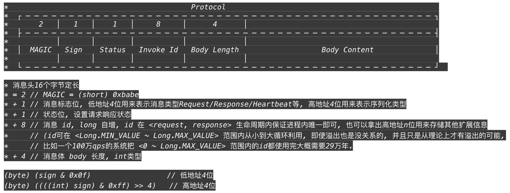

    
__协议体__
* metadata: <group, providerName, version>
* methodName
* ~~parameterTypes[]~~ 真的需要? 
    * 有什么问题?
        1. 反序列化时ClassLoader.loadClass()潜在锁竞争
        2. 协议体码流大小
        3. 泛化调用多了参数类型
    * 能解决吗?
        * Java方法静态分派规则参考JLS <Java语言规范> \$15.12.2.5 Choosing the Most Specific Method 章节
* args[]
* 其他: traceId, appName…

## 一些Features&好的实践&压榨性能
* ### __创建客户端代理对象__
    * Proxy做什么?
        * 集群容错 —> 负载均衡 —> 网络
    * 有哪些创建Proxy的方式?
        * jdk proxy/javassist/cglib/asm/bytebuddy
    * 要注意的:
        * 注意拦截toString, equals, hashCode等方法避免远程调用
    * 推荐的(bytebuddy):

    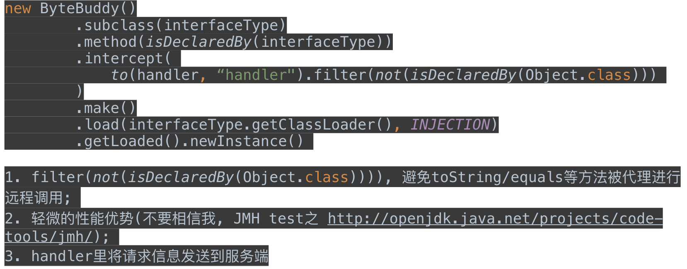

        
* ### __优雅的同步/异步调用__
    * 往上翻再看看'远程调用客户端图解'
    * 思考下如何拿到future?

* ### __单播/组播__
    * 消息派发器
    * FutureGroup

* ### __泛化调用__
    * Object \$invoke(String methodName, Object... args)
    * <del>parameterTypes[]</del>
    
* ### __序列化/反序列化(协议header标记serializer type, 同时支持多种)__

* ### __可扩展性__
    * Java SPI
        * -java.util.ServiceLoader
        * -META-INF/services/com.xxx.Xxx

* ### __服务级别线程池隔离__
    * 要挂你先挂, 别拉着我
    
* ### __责任链模式的拦截器__
    * 太多扩展需要从这里起步
    
* ### __指标度量(Metrics)__

* ### __链路追踪__
    * [OpenTracing](https://github.com/opentracing/opentracing-java)
    
* ### __注册中心__
    * 略
    
* ### __流控(应用级别/服务级别)__
    * 要有能方便接入第三方流控中间件的扩展能力
    
* ### __Provider线程池满了怎么办?__

    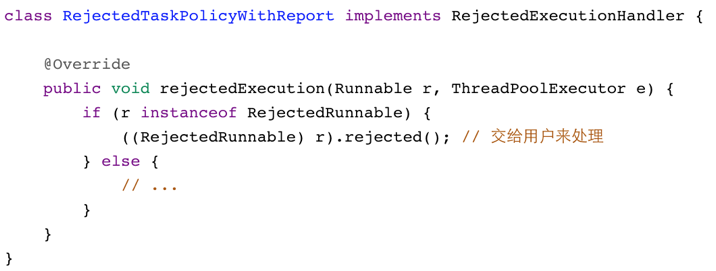

    
* ### __软负载均衡__
    * __加权随机__

        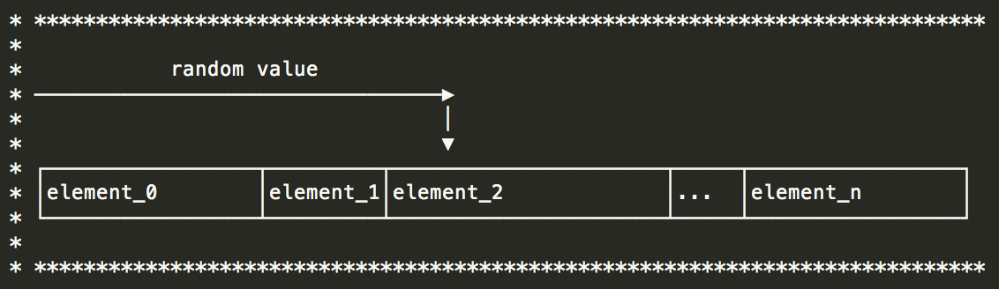

    * __加权轮训(最大公约数)__

        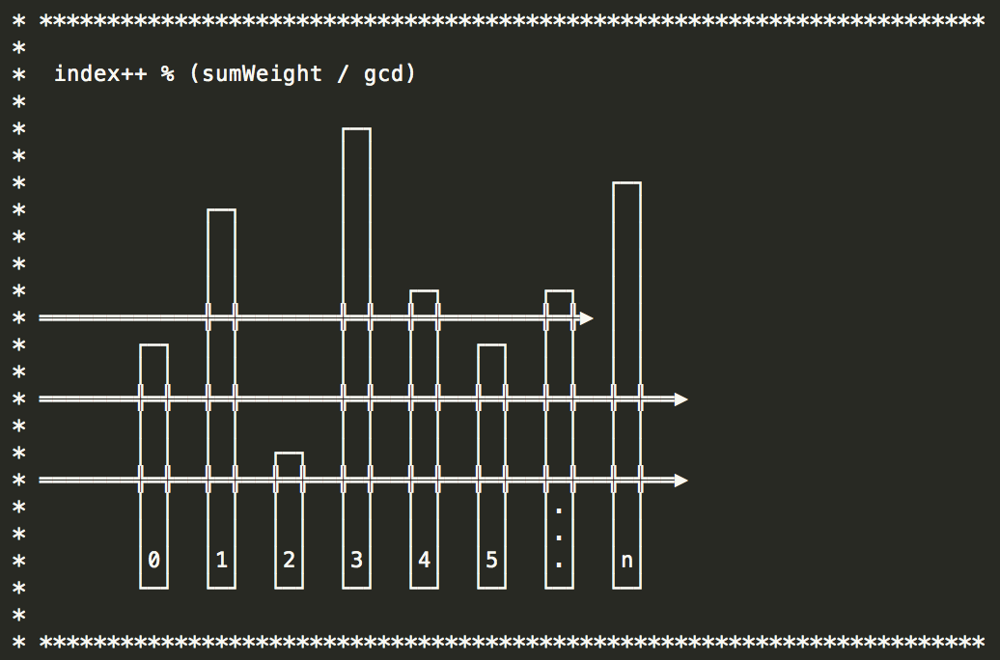

    * __最小负载__
    * __一致性hash(有状态服务场景)__
    * __其他__

    要有预热逻辑

* ### __集群容错__
    * __Fail-fast__
    * __Failover__
        * 异步调用怎么处理?
        * Bad :disappointed_relieved:

            

        * Better :grinning:

            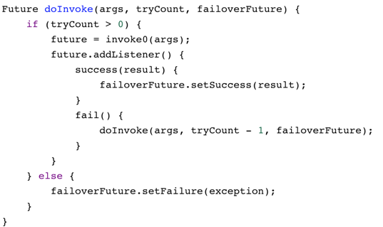

    * __Fail-safe__
    * __Fail-back__
    * __Forking__
    * __其他__

## 如何压榨性能(Don’t trust it, Test it)
* __ASM写个FastMethodAccessor来代替服务端那个反射调用__

    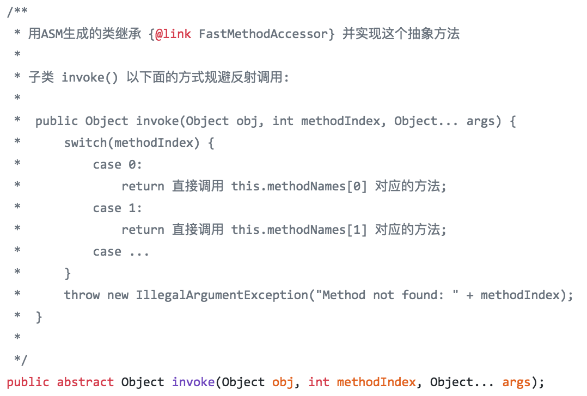

    
* __序列化/反序列化__
    * 在业务线程中序列化/反序列化, 避免占用IO线程
        * 序列化/反序列化占用数量极少的IO线程时间片
        * 反序列化常常会涉及到Class的加载, loadClass有一把锁竞争严重(可通过JMC观察一下)
    * 选择高效的序列化/反序列化框架(kryo/protobuf/protostuff/hessian/fastjson/…)
        * [https://github.com/eishay/jvm-serializers/wiki](https://github.com/eishay/jvm-serializers/wiki)
    * 选择只是第一步, 它(序列化框架)做的不好的, 去扩展和优化之
        * 传统的序列化/反序列化+写入/读取网络的流程
            * java对象--> byte[] -->堆外内存 / 堆外内存--> byte[] -->java对象
        * 新社会主义优化
            * 省去byte[]环节, 直接读/写 堆外内存, 这需要扩展对应的序列化框架
    * String编码/解码优化
    * Varint优化
        * 多次writeByte合并为writeShort/writeInt/writeLong
    * Protostuff优化举例
        * [UnsafeNioBufInput 直接读堆外内存](https://github.com/fengjiachun/Jupiter/blob/master/jupiter-serialization/jupiter-serialization-protostuff/src/main/java/org/jupiter/serialization/proto/io/UnsafeNioBufInput.java)
        * [UnsafeNioBufOutput 直接写堆外内存](https://github.com/fengjiachun/Jupiter/blob/master/jupiter-serialization/jupiter-serialization-protostuff/src/main/java/org/jupiter/serialization/proto/io/UnsafeNioBufOutput.java)
        
* __IO线程绑定CPU__
    * [https://github.com/OpenHFT/Java-Thread-Affinity](https://github.com/OpenHFT/Java-Thread-Affinity)
    
* __同步阻塞调用的客户端和容易成为瓶颈, 客户端协程?__
    * Java层面可选的并不多, 暂时也都不完美 :disappointed_relieved:

        | 类型 | 特点 |
        | --- | --- |
        | kilim | 编译期间字节码增强 |
        | quasar | agent动态字节码增强 |
        | ali\_wisp | ali\_jvm在底层直接实现 |

    
* __Netty Native Transport & PooledByteBufAllocator__
    * 减小GC带来的波动
    
* __尽快释放IO线程去做他该做的事情, 尽量减少线程上下文切换__

## Why Netty?
* ### __BIO vs NIO__

    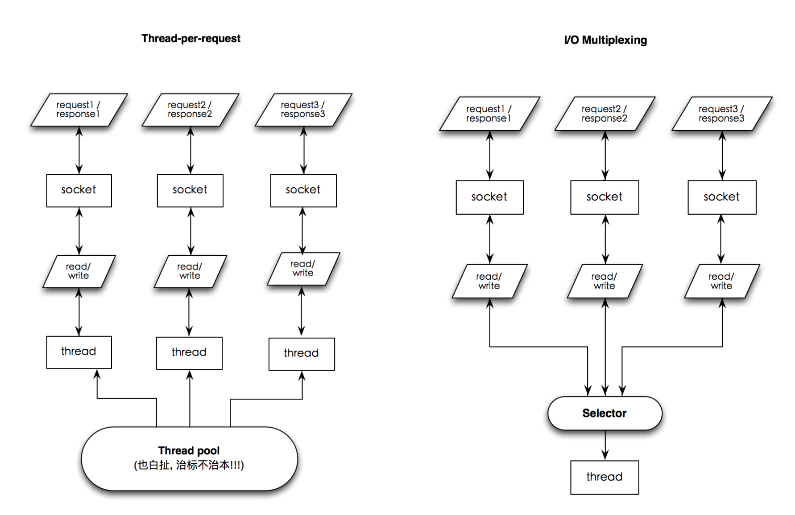

    
    
* ### __Java原生NIO API从入门到放弃__
    * __复杂度高__
        * API复杂难懂, 入门困难
        * 粘包/半包问题费神
        * 需超强的并发/异步编程功底, 否则很难写出高效稳定的实现
        
    * __稳定性差, 坑多且深__
        * 调试困难, 偶尔遭遇匪夷所思极难重现的bug, 边哭边查是常有的事儿
        * linux下EPollArrayWrapper.epollWait直接返回导致空轮训进而导致100% cpu的bug一直也没解决利索, Netty帮你work around(通过rebuilding selector)
        
    * __NIO代码实现方面的一些缺点__
        * Selector.selectedKeys() 产生太多垃圾
            * Netty修改了sun.nio.ch.SelectorImpl的实现, 使用双数组代替HashSet存储来selectedKeys
                * 相比*HashSet(*迭代器*, *包装对象等*)*少了一些垃圾的产生*(help GC)*
                * 轻微的性能收益*(1~2%)*
                
        * Nio的代码到处是synchronized (比如allocate direct buffer和Selector.wakeup())
            * 对于allocate direct buffer, Netty的pooledBytebuf有前置TLAB(Thread-local allocation buffer)可有效的减少去竞争锁
            * wakeup调用多了锁竞争严重并且开销非常大(开销大原因: 为了在select线程外跟select线程通信, linux下用一对pipe, windows下由于pipe句柄不能放入fd\_set, 只能委曲求全用两个tcp连接模拟), wakeup调用少了容易导致select时不必要的阻塞(如果懵逼了就直接用Netty吧, Netty中有对应的优化逻辑)
            * Netty Native Transport中锁少了很多
            
        * fdToKey映射
            * EPollSelectorImpl#fdToKey维持着所有连接的fd(描述符)对应SelectionKey的映射, 是个HashMap
            * 每个worker线程有一个selector, 也就是每个worker有一个fdToKey, 这些fdToKey大致均分了所有连接
            * 想象一下单机hold几十万的连接的场景, HashMap从默认size=16, 一步一步rehash...
            
        * Selector在linux平台是Epoll LT实现
            * Netty Native Transport支持Epoll ET
            
        * Direct Buffers事实上还是由GC管理
            * DirectByteBuffer.cleaner这个虚引用负责free direct memory, DirectByteBuffer只是个壳子, 这个壳子如果坚强的活下去熬过新生代的年龄限制最终晋升到老年代将是一件让人伤心的事情…
            * 无法申请到足够的direct memory会显式触发GC, Bits.reserveMemory() -> { System.gc() }, 首先因为GC中断整个进程不说, 代码中还sleep 100毫秒, 醒了要是发现还不行就OOM
            * 更糟的是如果你听信了个别<XX优化宝典>谗言设置了-XX:+DisableExplicitGC参数, 悲剧会静悄悄的发生...
            * Netty的UnpooledUnsafeNoCleanerDirectByteBuf去掉了cleaner, 由Netty框架维护引用计数来实时的去释放

## Netty的真实面目
### Netty中几个重要概念及其关系
* EventLoop
    * 一个Selector
    * 一个任务队列(mpsc\_queue: 多生产者单消费者 lock-free)
    * 一个延迟任务队列(delay\_queue: 一个二叉堆结构的优先级队列, 复杂度为O(log n))
    * EventLoop绑定了一个Thread, 这直接避免了pipeline中的线程竞争
* Boss: mainReactor角色, Worker: subReactor角色
    * Boss和Worker共用EventLoop的代码逻辑, Boss处理accept事件, Worker处理read, write等事件
    * Boss监听并accept连接(channel)后以轮训的方式将channel交给Worker, Worker负责处理此channel后续的read/write等IO事件
    * 在不bind多端口的情况下BossEventLoopGroup中只需要包含一个EventLoop, 也只能用上一个, 多了没用
    * WorkerEventLoopGroup中一般包含多个EventLoop, 经验值一般为 cpu cores \* 2(根据场景测试找出最佳值才是王道)
    * Channel分两大类ServerChannel和Channel, ServerChannel对应着监听套接字(ServerSocketChannel), Channel对应着一个网络连接
### Netty4 Thread Model

   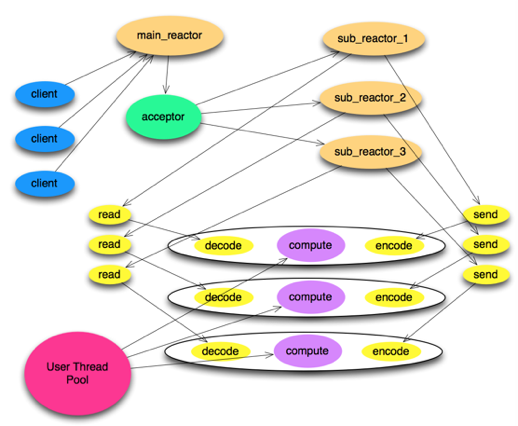

### ChannelPipeline

   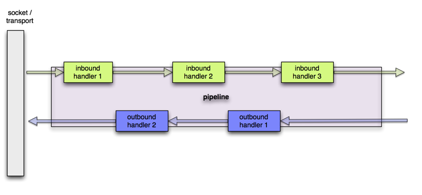

### 
### Pooling & reuse
* __PooledByteBufAllocator__
    * 基于 jemalloc paper (3.x)
    * ThreadLocal caches for lock free
        * 这个做法导致曾经有坑: 申请(Bytebuf)线程与归还(Bytebuf)线程不是同一个导致内存泄漏, 后来用一个mpsc\_queue解决, 代价就是牺牲了一点点性能
    * Different size classes
* __Recycler__
    * ThreadLocal + Stack
    * 曾经有坑, 申请(元素)线程与归还(元素)线程不是同一个导致内存泄漏
    * 后来改进为不同线程归还元素的时候放入一个WeakOrderQueue中并关联到stack上, 下次pop时如果stack为空则先扫描所有关联到当前stack上的weakOrderQueue
    * WeakOrderQueue是多个数组的链表, 每个数组默认size=16
    * 问题: 老年代对象引用新生代对象对GC的影响

### Netty Native Transport
* 相比Nio创建更少的对象, 更小的GC压力
* 针对linux平台优化, 一些specific features
    * SO\_REUSEPORT - 端口复用(允许多个socket监听同一个IP+端口, 与RPS/RFS协作, 可进一步提升性能)
        * 可把RPS/RFS模糊的理解为在软件层面模拟多队列网卡, 并提供负载均衡能力, 避免网卡收包发包的中断集中的一个CPU core上而影响性能
    * TCP\_FASTOPEN - 3次握手时也用来交换数据
    * EDGE\_TRIGGERED (支持Epoll ET是重点)
    * Unix域套接字

### 多路复用简介
* __select/poll__
    * 本身的实现机制上的限制(采用轮询方式检测就绪事件, 时间复杂度: O(n), 每次还要将臃肿的fd\_set在用户空间和内核空间拷贝来拷贝去), 并发连接越大, 性能越差
    * poll相比select没有很大差异, 只是取消了最大文件描述符个数的限制
    * select/poll都是LT模式
* __epoll__
    * 采用回调方式检测就绪事件, 时间复杂度: O(1), 每次epoll\_wait调用只返回已就绪的文件描述符
    * epoll支持LT和ET模式

### 稍微深入了解一点Epoll
* __LT vs ET__
    * 概念
        * LT:  level-triggered 水平触发
        * ET: edge-triggered 边沿触发
    * 可读
        * buffer不为空的时候fd的events中对应的可读状态就被置为1, 否则为0
    * 可写
        * buffer中有空间可写的时候fd的events中对应的可写状态就被置为1, 否则为0
    * 图解

        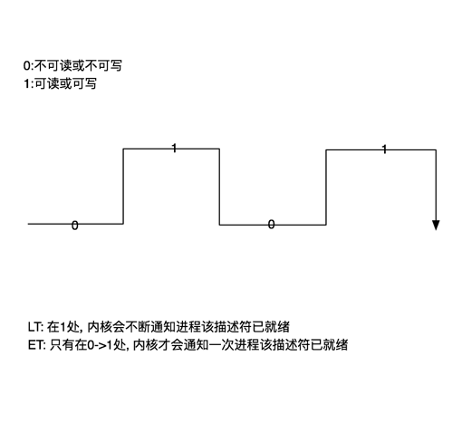

        
* __epoll三个方法简介__
    * 主要代码: linux-2.6.11.12/fs/eventpoll.c
    * __int epoll\_create(int size)__
        * 创建rb-tree(红黑树)和ready-list(就绪链表)
            * 红黑树O(logN), 平衡效率和内存占用, 在容量需求不能确定并可能量很大的情况下红黑树是最佳选择
            * size参数已经没什么意义, 早期epoll实现是hash表, 所以需要size参数
    * __int epoll\_ctl(int epfd, int op, int fd, struct epoll\_event \*event)__
        * 把epitem放入rb-tree并向内核中断处理程序注册ep\_poll\_callback, callback触发时把该epitem放进ready-list
    * __int epoll\_wait(int epfd, struct epoll\_event \* events, int maxevents, int timeout)__
        * ready-list —> events[]

* __epoll的数据结构__

    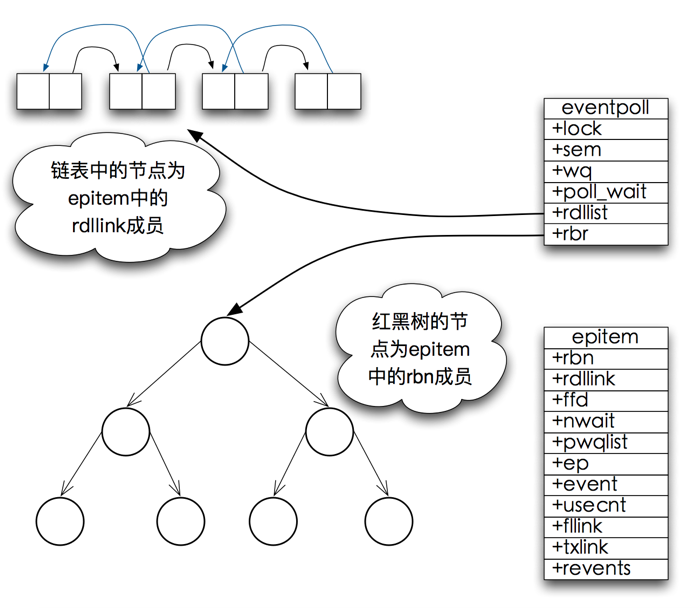

        
* __epoll\_wait工作流程概述__
    * epoll\_wait调用ep\_poll
        * 当rdlist(ready-list)为空(无就绪fd)时挂起当前线程, 直到rdlist不为空时线程才被唤醒
    * 文件描述符fd的events状态改变
        * buffer由不可读变为可读或由不可写变为可写, 导致相应fd上的回调函数ep\_poll\_callback被触发
    * ep\_poll\_callback被触发
        * 将相应fd对应epitem加入rdlist, 导致rdlist不空, 线程被唤醒, epoll\_wait得以继续执行
    * 执行ep\_events\_transfer函数
        * 将rdlist中的epitem拷贝到txlist中, 并将rdlist清空
        * 如果是epoll LT, 并且fd.events状态没有改变(比如buffer中数据没读完并不会改变状态), 会再重新将epitem放回rdlist
    * 执行ep\_send\_events函数
        * 扫描txlist中的每个epitem, 调用其关联fd对应的poll方法取得较新的events
        * 将取得的events和相应的fd发送到用户空间

### Netty的最佳实践
* 业务线程池必要性
    * 业务逻辑尤其是阻塞时间较长的逻辑, 不要占用netty的IO线程, dispatch到业务线程池中去
* WriteBufferWaterMark, 注意默认的高低水位线设置(32K~64K), 根据场景适当调整
* 重写MessageSizeEstimator来反应真实的高低水位线
    * 默认实现不能计算对象size, 由于write时还没路过任何一个outboundHandler就已经开始计算message size, 此时对象还没有被encode成Bytebuf, 所以size计算肯定是不准确的(偏低)
* 注意EventLoop#ioRatio的设置(默认50), 这是EventLoop执行IO任务和非IO任务的一个时间比例上的控制
* 空闲链路检测用谁调度?
    * Netty4.x默认使用IO线程调度, 使用eventLoop的delayQueue, 一个二叉堆实现的优先级队列, 复杂度为O(log N), 每个worker处理自己的链路监测, 有助于减少上下文切换, 但是网络IO操作与idle会相互影响
    * 如果总的连接数小, 比如几万以内, 上面的实现并没什么问题, 连接数大建议用HashedWheelTimer实现一个IdleStateHandler, HashedWheelTimer复杂度为 O(1), 同时可以让网络IO操作和idle互不影响, 但有上下文切换开销
* 使用ctx.writeAndFlush还是channel.writeAndFlush?
    * ctx.write直接走到下一个outbound handler, 注意别让它违背你的初衷绕过了空闲链路检测
    * channel.write从末尾开始倒着向前挨个路过pipeline中的所有outbound handlers
* 使用Bytebuf.forEachByte() 来代替循环 ByteBuf.readByte()的遍历操作, 避免rangeCheck()
* 使用CompositeByteBuf来避免不必要的内存拷贝
    * 缺点是索引计算时间复杂度高, 请根据自己场景衡量
* 如果要读一个int, 用Bytebuf.readInt(), 不要Bytebuf.readBytes(buf, 0, 4)
    * 这能避免一次memory copy (long, short等同理)
* 配置UnpooledUnsafeNoCleanerDirectByteBuf来代替jdk的DirectByteBuf, 让netty框架基于引用计数来释放堆外内存
    * io.netty.maxDirectMemory
        * < 0:  不使用cleaner, netty方面直接继承jdk设置的最大direct memory size, (jdk的direct memory size是独立的, 这将导致总的direct memory size将是jdk配置的2倍)
        * == 0: 使用cleaner, netty方面不设置最大direct memory size
        * \> 0:  不使用cleaner, 并且这个参数将直接限制netty的最大direct memory size, (jdk的direct memory size是独立的, 不受此参数限制)
* 最佳连接数
    * 一条连接有瓶颈, 无法有效利用cpu, 连接太多也白扯, 最佳实践是根据自己场景测试
* 使用PooledBytebuf时要善于利用 -Dio.netty.leakDetection.level 参数
    * 四种级别: DISABLED(禁用), SIMPLE(简单), ADVANCED(高级), PARANOID(偏执)
    * SIMPLE, ADVANCED采样率相同, 不到1%(按位与操作 mask ==128 - 1)
    * 默认是SIMPLE级别, 开销不大
    * 出现泄漏时日志会出现”LEAK: ”字样, 请时不时grep下日志, 一旦出现”LEAK: ”立刻改为ADVANCED级别再跑, 可以报告泄漏对象在哪被访问的
    * PARANOID: 测试的时候建议使用这个级别, 100%采样
* Channel.attr(), 将自己的对象attach到channel上
    * 拉链法实现的线程安全的hash表, 也是分段锁(只锁链表头), 只有hash冲突的情况下才有锁竞争(类似ConcurrentHashMapV8版本)
    * 默认hash表只有4个桶, 使用不要太任性

### 从Netty源码中学到的代码技巧
* 海量对象场景中 AtomicIntegerFieldUpdater --> AtomicInteger
    * Java中对象头12 bytes(开启压缩指针的情况下), 又因为Java对象按照8字节对齐, 所以对象最小16 bytes, AtomicInteger大小为16 bytes, AtomicLong大小为 24 bytes
    * AtomicIntegerFieldUpdater作为static field去操作volatile int
* FastThreadLocal, 相比jdk的实现更快
    * 线性探测的Hash表 —> index原子自增的裸数组存储
* IntObjectHashMap / LongObjectHashMap …
    * Integer—> int
    * Node[] —> 裸数组
    * 哈希冲突: 拉链法 —> 线性探测
* RecyclableArrayList, 基于前面说的Recycler, 频繁new ArrayList的场景可考虑
* JCTools: 一些jdk没有的 SPSC/MPSC/SPMC/MPMC 无锁并发队以及NonblockingHashMap(可以对比ConcurrentHashMapV6/V8)

## 参考资料
* Netty
    * [https://github.com/netty/netty](https://github.com/netty/netty)
    * [https://www.infoq.com/presentations/apple-netty](https://www.infoq.com/presentations/apple-netty)
* JDK-source
    * /jdk/src/solaris/classes/sun/nio/ch/EPollSelectorImpl.java
    * /jdk/src/solaris/classes/sun/nio/ch/EPollArrayWrapper.java
    * /jdk/src/solaris/native/sun/nio/ch/EPollArrayWrapper.c
* Linux-source
    * linux-2.6.11.12/fs/eventpoll.c
    * https://code.csdn.net/chenyu105/linux\_kernel\_2-6-11-12\_comment/tree/master
    * [https://github.com/torvalds/linux](https://github.com/torvalds/linux)
* RPS/RFS
    * [https://my.oschina.net/guol/blog/113144](https://my.oschina.net/guol/blog/113144)
* I/O Multiplexing
    * <UNIX网络编程>卷1 第六章
    * [http://www.python4science.eu/multiplex\_io.html](http://www.python4science.eu/multiplex_io.html)
    * [http://blog.csdn.net/russell\_tao/article/details/17119729](http://blog.csdn.net/russell_tao/article/details/17119729)
* jemalloc
    * [http://jemalloc.net/](http://jemalloc.net/)
    * [https://www.bsdcan.org/2006/papers/jemalloc.pdf](https://www.bsdcan.org/2006/papers/jemalloc.pdf)
* SO\_REUSEPORT
    * [https://my.oschina.net/miffa/blog/390931](https://my.oschina.net/miffa/blog/390931)
* TCP\_FASTOPEN
    * [https://www.oschina.net/question/12\_137950](https://www.oschina.net/question/12_137950)
* 最佳实践主要参考来源
    * [http://calvin1978.blogcn.com/articles/netty-info.html](http://calvin1978.blogcn.com/articles/netty-info.html)

